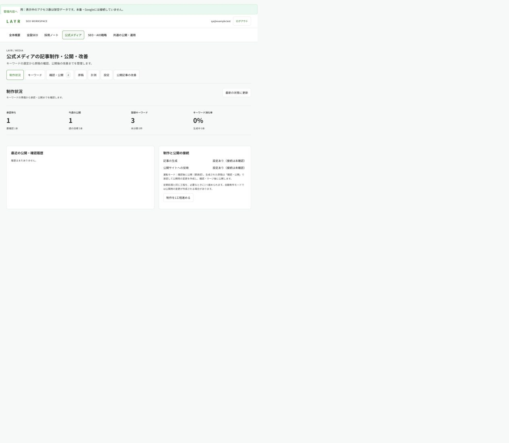
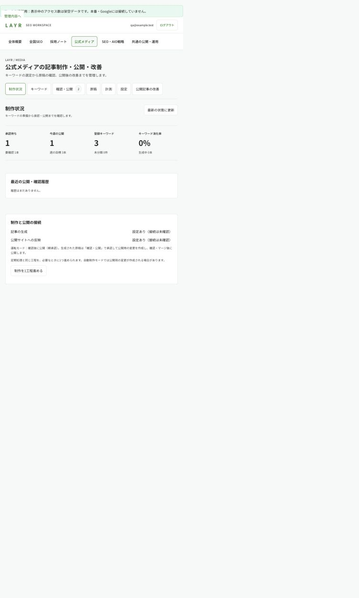
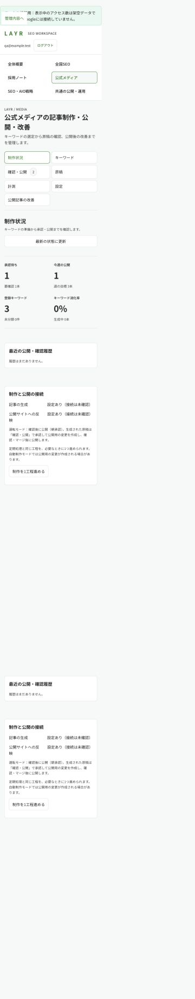

# 記事制作統合の検収 / モードD / 2026-09-23

## 対象と差分

`articles.astro`、`KijiWorkbench.astro`、`kiji-workbench.css`、記事管理のクライアント2本。既存の共有デザイントークン、全国SEO、採用ノート、公開サイト本文は変更しない。

## 機能している点

- ワークスペースの既存ナビゲーションを維持し、制作から改善までを7タブで切り替えられる。
- 空状態、接続失敗、保存競合、公開確認待ち、計測片側未取得を区別する。
- 新規色・影・書体を追加せず、キーボードfocus、フォームラベル、44px操作領域を共有する。

## ゲート

新CSS単体は共通変数が別ファイル定義のためG17が解決できない。実際に読み込む共有トークンを合わせた検証ファイルで12/12 PASS。新規影0、中央揃え0、直値hex0、太字800/900が0、未定義変数0。プロジェクト全体の回帰ゲートも悪化なし。

375 / 390 / 768 / 1280 / 1440pxで確認。375、390、768、1440pxのdocument幅がviewport以下、h1は1。表は領域内スクロール。reduced-motion対応あり。本文・補助文字は既存の濃いtext/mutedトークンを使用する。

## 操作確認

架空データ専用ローカル画面で、キーワード保存と再取得、原稿編集・プレビュー・保存、公開前確認と公開確認待ち、計測の0と未取得、設定・接続確認の導線、空一覧、接続失敗、保存失敗後の入力保持を確認。

未保存内容を閉じる際のブラウザ標準confirmは、in-app browserの操作ツールがタイムアウトしたため手動での確定操作は未検証。入力保持・キャンセルの分岐はクライアントテストで検証。実記事生成・本番公開・本番設定変更はQAでは行わない。

## 独立コードレビュー

原稿保存のbindずれ、公開不明時の照合導線、PRリンク参照、未取得CTA表示、設定の部分更新検証、紐付済みキーワードの状態保護を修正し回帰テストを追加。未解消のP1/P2指摘なし。

最終テスト：公開サイト側316件、非公開記事処理側31件がPASS。全74ページのビルド、両Workerのdry-run、差分空白チェック正常。

## スクリーンショット

ローカルの架空データであり、本番アクセス実績ではない。

PASS
