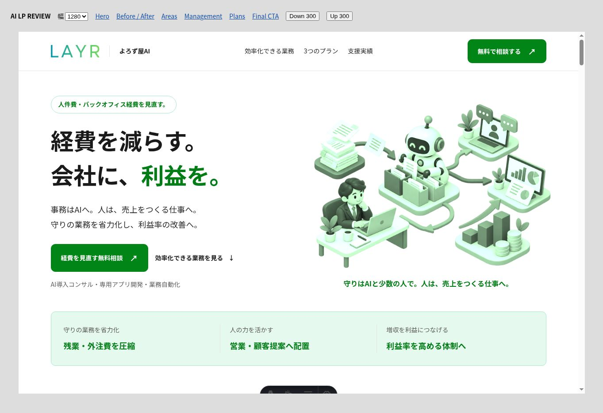
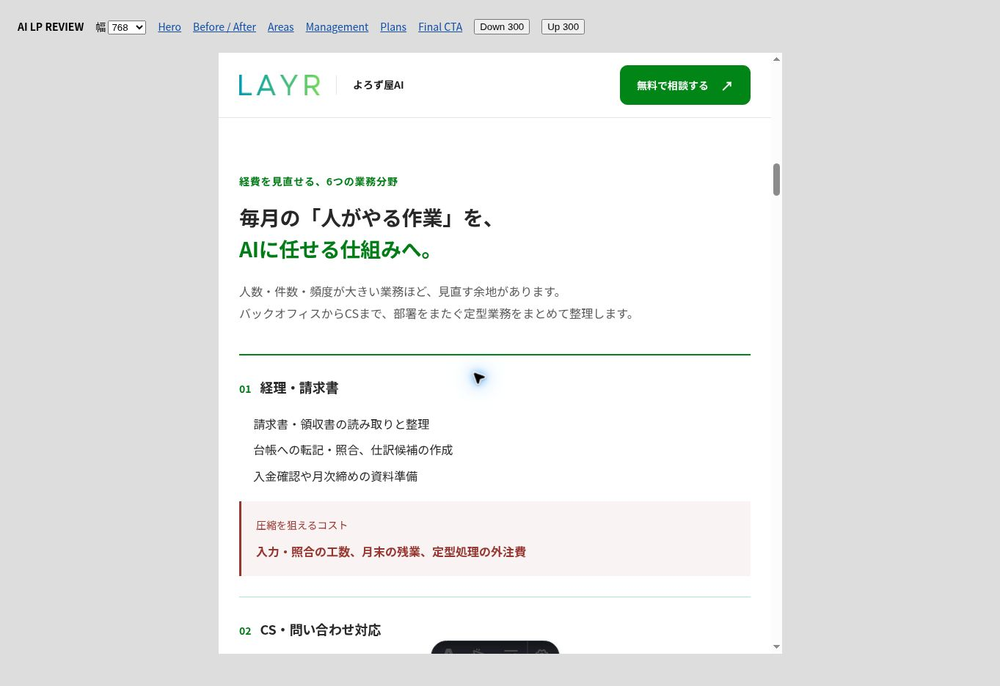
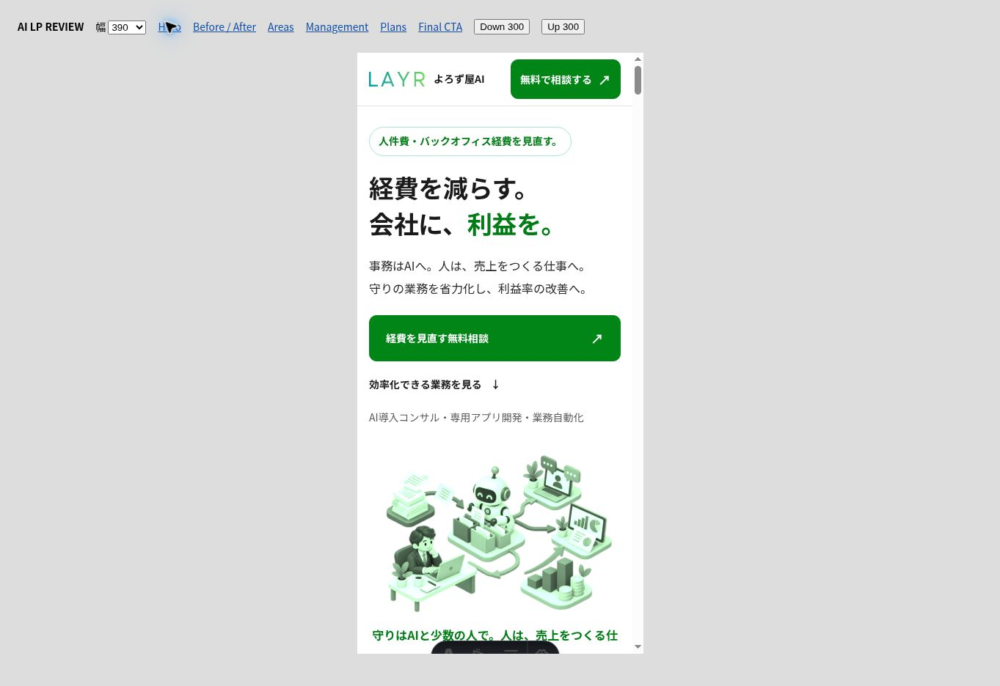
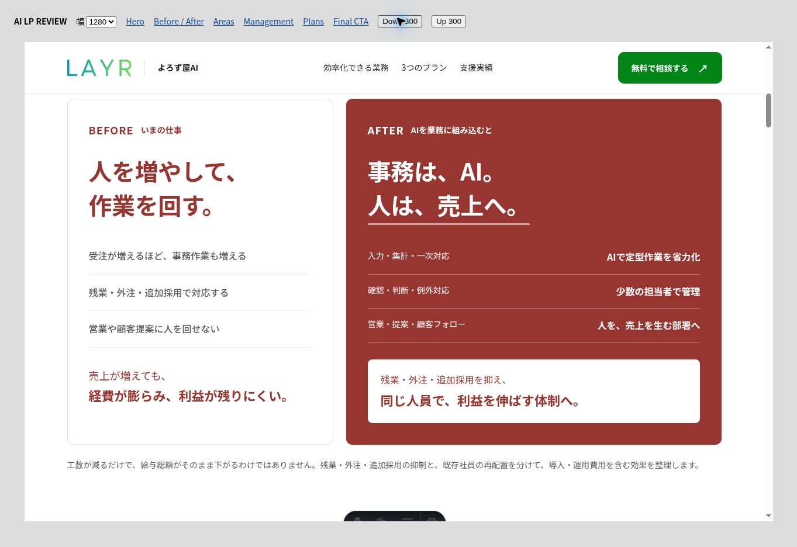

# AI LP: recurring costs and staff reallocation

User-directed follow-up to PR #7. Existing production authorization applies.

## Result

- White and green base; deep red emphasizes Before/After, plan prices, and the monthly five-company invoice offer.
- Hero: 「経費を減らす。会社に、利益を。」 Supporting message: routine administration to AI, people to revenue-producing work.
- Six data-driven fields: accounting/invoices, customer support, order/sales administration, general affairs/applications, HR administration, monthly reporting. Each maps concrete tasks to potential time/overtime/outsourcing savings.
- Unified-management section shows collection, AI processing and human confirmation, followed by redeployment to sales, proposals and customer follow-up.
- Clarifies that freed hours do not automatically reduce salaries; direct spending reductions and staff reallocation are assessed separately, including implementation/operating costs. No invented savings percentages, headcounts, or live remaining-slot counts.
- Three plan prices and both invoice CTAs retained. Service listing, FAQ and metadata match the revised positioning.

## Artwork and palette

Removed the previous blue presentation token and classes. The existing transparent hero asset is reused with one shared green color-treatment token on the AI LP and service listing. Original screenshots of real internal tools are preserved as factual examples.

One built-in ImageGen edit was attempted by the asset-only agent required by Sites: preserve the existing composition and replace blue/cyan/gold with emerald/forest/pale green and white, retaining transparent alpha and adding no objects/text/logos. Its RGB output included a baked checkerboard, so it was rejected without retry. The existing clean alpha asset with CSS color treatment was selected and visually verified instead; no broken generated image is shipped.

## Checks

- Production build passed: 49 routes.
- Regression gate passed with no baseline changes (G1 remains 89 against baseline 90; other values unchanged).
- 1280 / 768 / 390 responsive harness checked. Content and scroll widths matched at 1265 / 753 / 375 respectively.
- Inspected hero, six-field list, deep-red comparison, unified management, three-plan pricing and final invoice CTA. Verified the hero's link to the new automation section.
- Static HTML checked for one H1, unique IDs and valid fragment links; six fields, three offers and two invoice CTAs; consistent prices and FAQ count; no old blue token.
- Temporary responsive harness removed before the final build. Screenshot chrome and Astro toolbar are development-only.

