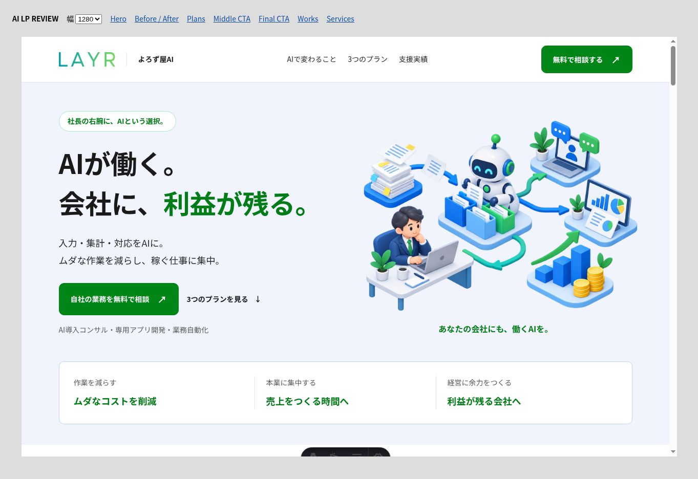
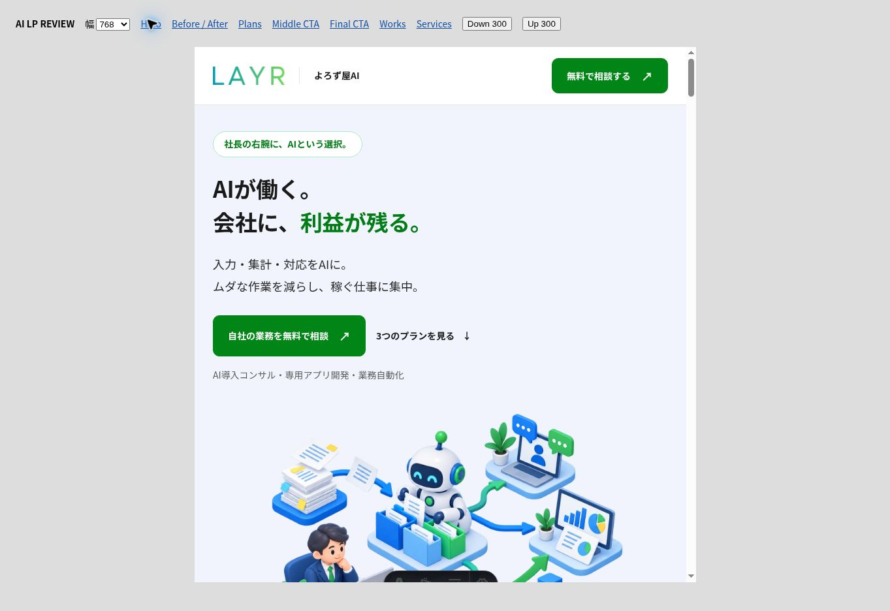
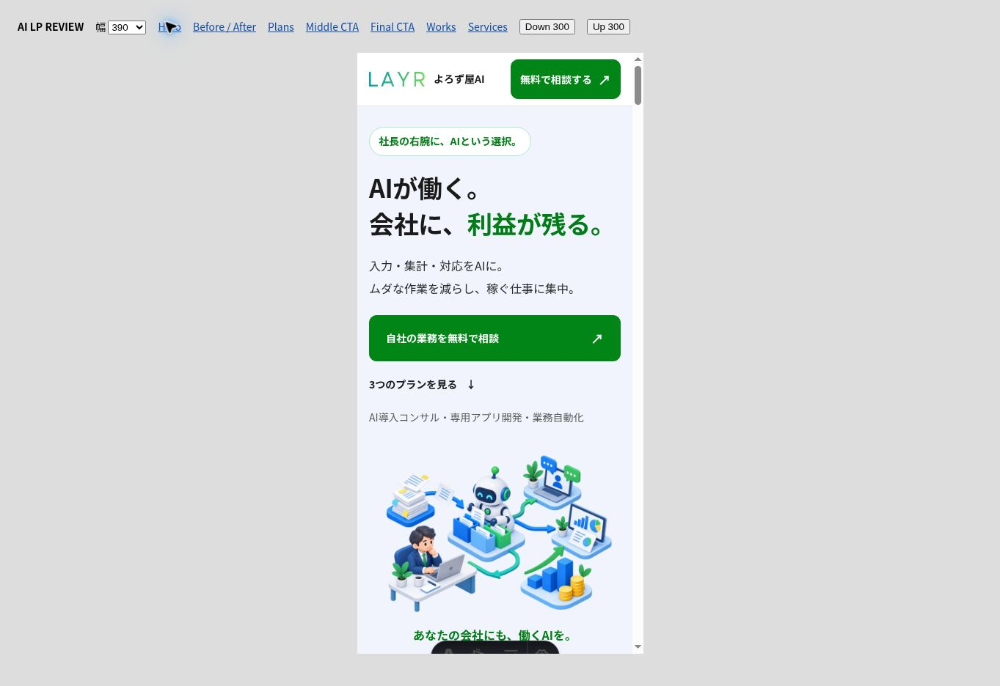
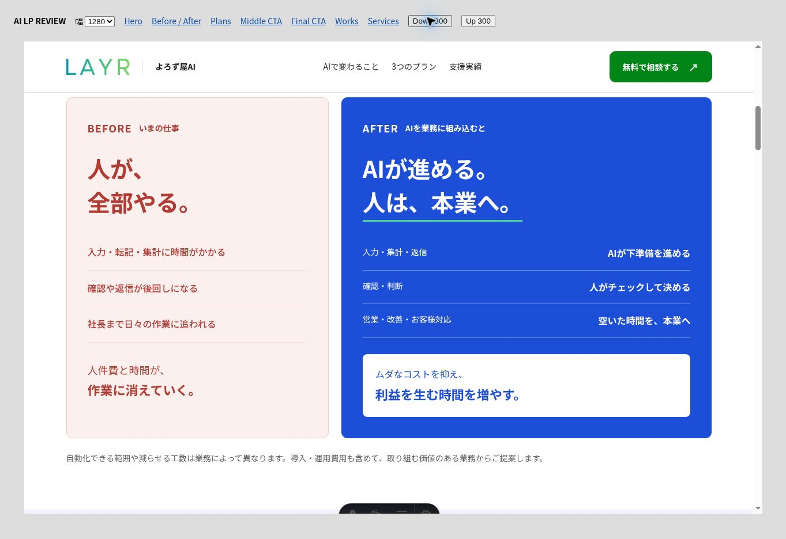
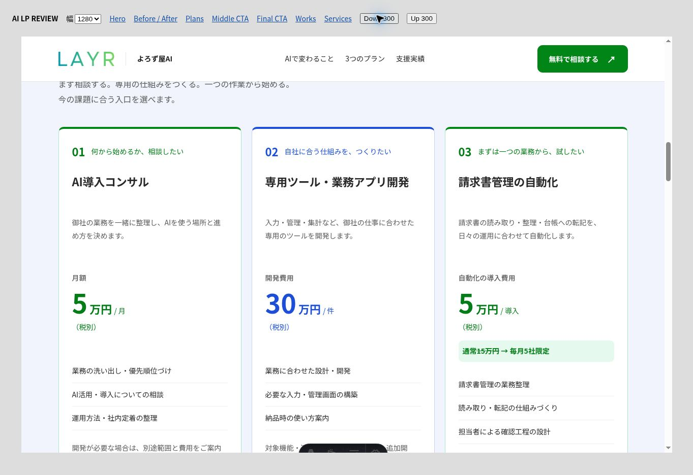
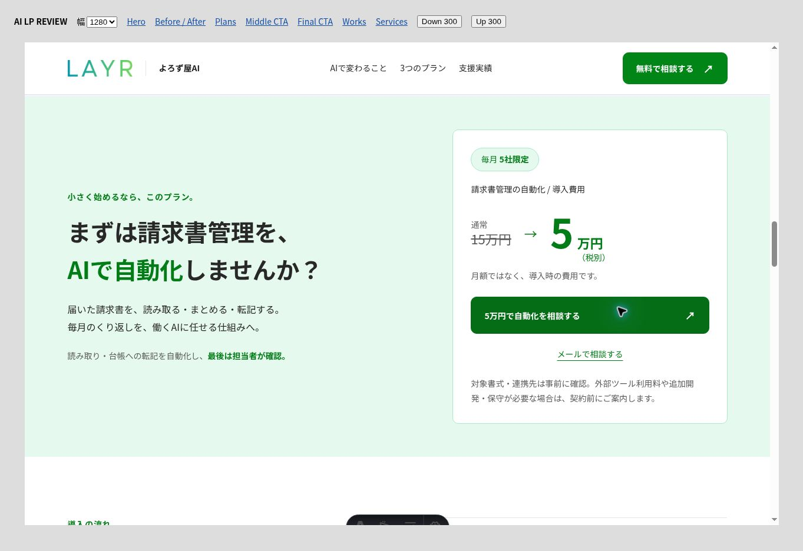
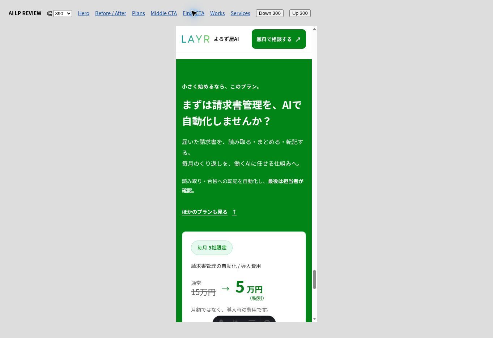
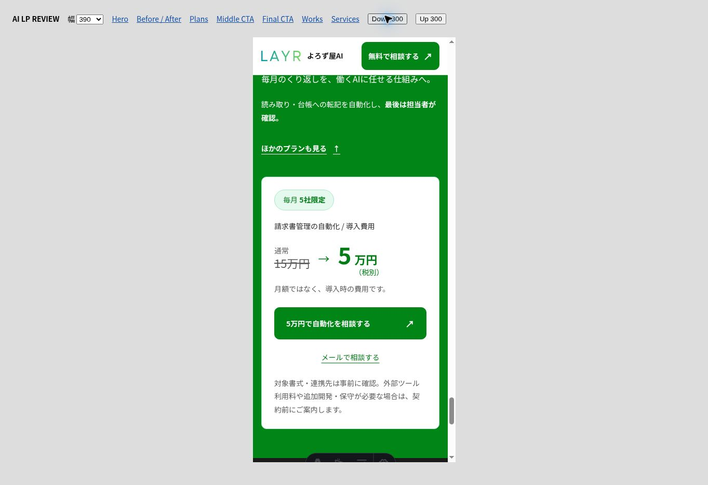

# AI LP: profitability and three plans

## Requested revision

The user requested a shorter hero, a friendly isometric AI-at-work illustration, stronger red Before / blue After contrast, three plans, and invoice CTAs in the middle and at the bottom. Their earlier explicit production-publishing instruction remains applicable.

- Hero: 「AIが働く。会社に、利益が残る。」
- AI導入コンサル: 50,000 JPY/month, excluding tax.
- 専用ツール・業務アプリ開発: 300,000 JPY/project, excluding tax.
- 請求書管理自動化: 50,000 JPY implementation fee, excluding tax; normally 150,000 JPY, limited to five companies per month.

The repeated AI-consulting wording in the spoken request is interpreted as one consulting plan: the user explicitly requested three plans with invoice automation third. Pricing data, visible plan cards, invoice CTA component, FAQs, metadata and Service structured data use the same source. The service listing uses the new illustration and three-plan positioning. The existing seafood-trade client case is retained without invented quantified outcomes.

## Design decisions

The user's explicit request authorizes a new image and stronger blue/red colors, overriding the general restrictions on adding images/colors for this change. Added one shared blue token; existing green, red, font weights, spacing and shape tokens are reused. After occupies the larger column and uses white headings on saturated blue. Typography and primary navigation remain readable at narrow widths. Shared footer, other services and homepage hero are preserved.

## Illustration source

Generated once with the built-in ImageGen tool through the asset-only illustration agent required by the Sites skill. The original 1536 × 1024 transparent PNG was inspected, then encoded as WebP at quality 87, preserving dimensions and alpha. Final asset: `public/service/ai/ai-office.webp` (186,038 bytes). No text, logos or numerical results are embedded.

Prompt: Create a single original bitmap hero illustration for a Japanese B2B AI automation service for SME owners. Cute, approachable isometric icon-like art of AI working inside a company, automating everyday tasks so a person can do meaningful work and the company can grow profit. One cohesive miniature office: a small friendly white robot with cobalt blue and emerald green accents organizing documents into records; compact customer communication and reporting stations connected by clean pathways; one professional businessperson calmly working at a thoughtful desk; small ascending cobalt blocks and a modest warm yellow coin stack. Polished isometric 3D/editorial style, adorable but professional, smooth matte rounded forms, crisp silhouette, subtle contact shadows, readable at 500px. Wide 3:2 balanced cluster with breathing room and no crop. Transparent real alpha, otherwise white. No text, letters, numbers, logos, watermark, border, enclosing card, screenshot, giant generic robot, clutter or multiple variants.

## Verification

- Production build: passed, 49 static routes.
- Regression gate: passed; no baseline change (G1 90 → 89; all others unchanged).
- Whitespace check: passed.
- Built HTML: one H1, unique IDs, all fragment links resolve, three offers at 50,000 / 300,000 / 50,000 JPY, tax treatment consistent, two invoice CTA sections, client catalog link retained, matching service-listing content.
- Browser: 1280 / 768 / 390 iframe widths; usable content widths 1265 / 753 / 375 because of the scrollbar. Document scroll widths matched at all three sizes; hero image loaded at 1536px intrinsic width.
- Verified internal plan and invoice links, FAQ disclosure, contact-link destinations, desktop comparison and pricing, and mobile final CTA. Contact links were inspected without sending messages.
- Screenshots use an isolated temporary responsive harness; its gray controls are QA-only. The harness was removed and is absent from the production build. Astro's development toolbar is also preview-only.
- Supervised preview recovered from a stale previous Astro development lock; no hosting configuration change was needed.

## Screenshots

