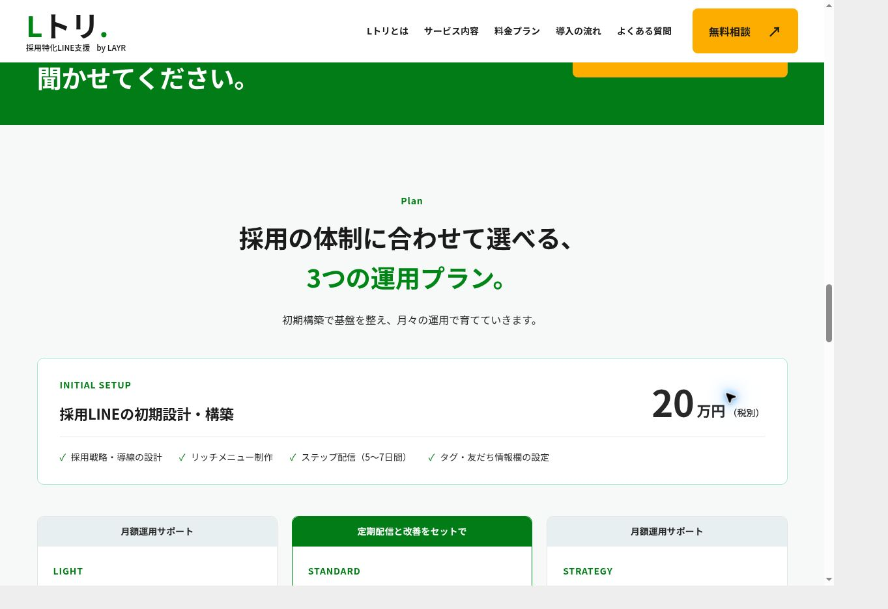

# Lトリ LP — 2026-09-14

採用特化LINE構築・運用支援「Lトリ」を `/service/ltori/` に追加。
既存のCloudflare Workers Static Assets / GitHub PRフローで公開する。
ユーザーが提示した会社URLと既存設定に合わせ、本文中の `rayer.co.jp` は `layr.co.jp` と解釈した。

## 内容・デザインの根拠

- 内容: [指定された採用LINEサービス資料](https://drive.google.com/file/d/1slR0-vMlSpqz4C0r14Srsd2XwemwBHzU/view)。閲覧権限が anyone/reader であることを確認。
- デザイン: [Lプロ](https://re-v.co.jp/lpro/)。写真中心のファーストビュー、白・緑、大きな日本語見出し、黄色の下線、オレンジ系CTA、課題→活用→サービス→料金→導入→FAQの流れを参考にした。
- 初期20万円、月額3万・5万・10万円、配信頻度、コンサル回数、別途費用を資料から反映（いずれも税別）。料金は `src/data/service-ltori.json` で管理。
- 資料中の労働力統計は数値に整合しない箇所があるため採用していない。根拠のない成果数値や実績は追加していない。
- 画面は架空企業「みどり製作所」の作例。LINEのロゴ・認証バッジや他社素材は使用していない。
- 人物写真はこの依頼用に生成したオリジナルのイメージ。実在のスタッフとして紹介していない。1536 × 1024 の WebP、84,560 bytes。
- 今回の写真主体の構成はユーザーが明示したLプロのオマージュ指定に基づく。既存ページ全体のスタイルを変更せず、専用CSSに分離して既存カラートークンを使用。

## 確認結果

- `npm run check`: 50ページ生成成功。デザインゲートの基準値から悪化なし。
- `git diff --check`: 成功。
- 新規ページ: h1 1個、正しいcanonical、参照先の画像と内部リンク・アンカーの存在を確認。
- 4シーンのタブ切替と矢印キー操作、FAQ開閉、モバイルメニューの開閉・リンク選択後の閉鎖をブラウザーで確認。
- スタンダードプランの相談先で「Lトリ（採用LINE）について」が選択され、本文に「スタンダードプランについて相談したいです。」が入ることを確認。フォーム送信は行っていない。
- CTAクリックは `select_content`、既存問い合わせフォームの送信成功は `generate_lead` を使用。

| 表示幅 | 内容領域の clientWidth / scrollWidth | 結果 |
| --- | --- | --- |
| 1280px | 1265 / 1265 | 横スクロールなし |
| 768px | 753 / 753 | 横スクロールなし |
| 390px | 375 / 375 | 横スクロールなし |

Cloudflareのプレビュー版 `0a6171cacea9c7449e292a04958c3aa6c16b8212` を確認。
ブラウザーの外枠は固定サイズのため、指定幅の同一オリジンiframeでレスポンシブ表示を検証した。
右側の灰色は確認用外枠。内容幅と表示幅の差15pxは縦スクロールバー。
確認専用ページは最終コミットで削除し、本番には含めない。

## スクリーンショット

### 1280px

### 768px

### 390px

### 料金セクション

