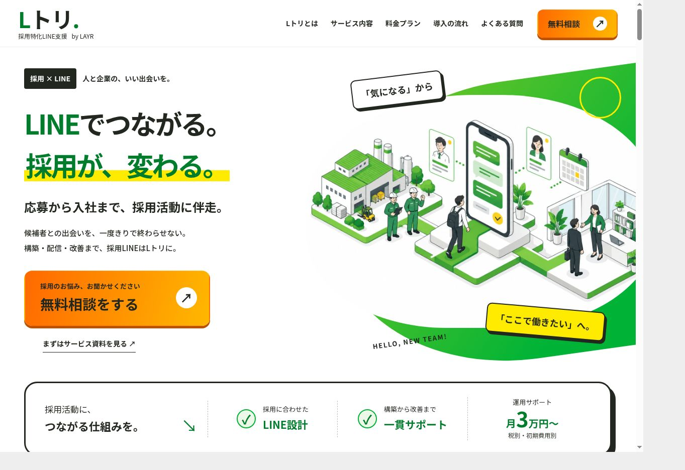
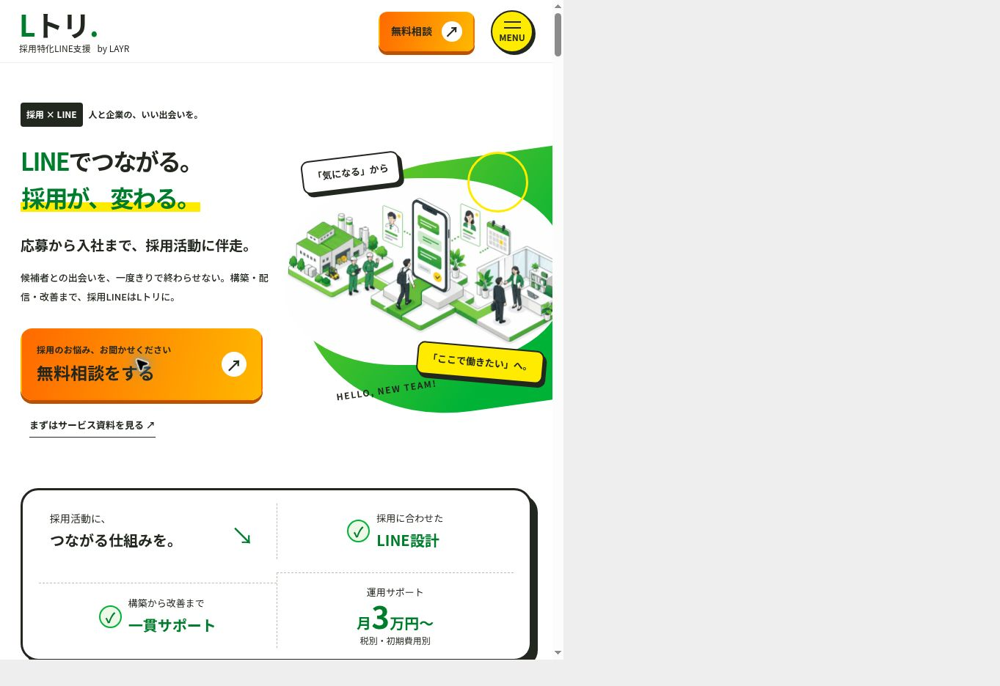
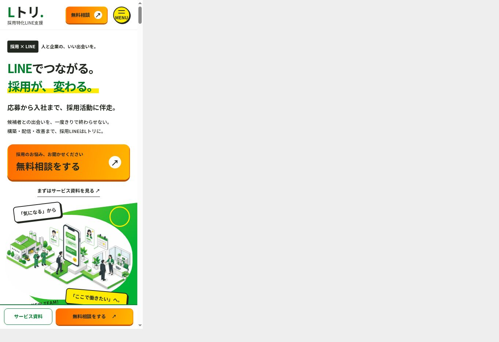
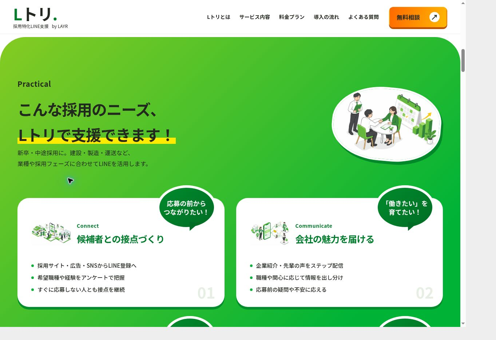

# Lトリ デザイン刷新 — 2026-09-15

対象: https://layr.co.jp/service/ltori/

## デザインの変更

ユーザーが添付したLプロの3画面（緑背景のニーズ、吹き出しCTA、特徴の交互レイアウト）を基準に再設計。
「過去のLAYRのLPやデザインマニュアルに沿った印象を変える」「アイソメトリックイラストを使用」という明示的な依頼に基づき、Lトリ専用の配色・角丸・影・見出しスケールを設定した。

- ライム〜鮮やかな緑の背景、黄色のマーカー、オレンジのグラデーションCTA。
- 吹き出し、白いカード、ずらした影、イラストとテキストを交互に配した4つの特徴。
- 人物写真を4種類のオリジナルのアイソメトリックイラストへ置換。
- CTAをイラストと大きな吹き出しの一体型バナーに変更。
- サービス一覧のLトリ画像とOGPにも新しいイラストを使用。

内容・料金の正本は `src/data/service-ltori.json`。初期20万円・月額3万/5万/10万円（税別）など、料金やサービス範囲は変更していない。
他サービスのデザイン、共通のデザインゲート基準値、問い合わせフォームの処理は変更していない。

## イラスト

組み込みの画像生成を使用。依頼に合わせたオリジナル4点で、他社の画像・ロゴを転載していない。
1536×1024 PNGからWebP（quality 87）へ形式変換。合計357,224 bytes。
最終保存先と生成プロンプトは [illustration-prompts.json](illustration-prompts.json) に記録。

## 検証

- `npm run check`: 50ページ生成、共通デザインゲートの基準値から悪化なし。
- `git diff --check`: 成功。
- h1は1個、タブ4個・パネル4個。内部アンカー・参照画像に欠落なし。
- canonicalは `https://layr.co.jp/service/ltori/`。
- メニュー開閉と料金セクションへの移動、タブ切替・矢印キー、FAQ開閉をブラウザーで確認。
- 料金別の相談リンクに `service=ltori` と選択プランを引き継ぐことを確認。フォームの実送信は行っていない。
- 最小文字サイズは12px。動きを抑える設定ではトランジションを停止。
- タブレットでイラストと文章が近づく箇所、ページ内移動で共通のスクロール余白が二重になる箇所を修正。

| 表示幅 | clientWidth / scrollWidth | 結果 |
| --- | --- | --- |
| 1280px | 1265 / 1265 | 横スクロールなし |
| 768px | 753 / 753 | 横スクロールなし |
| 390px | 375 / 375 | 横スクロールなし |

ブラウザー外枠は固定サイズのため、各幅の同一オリジンiframeで確認。右側の灰色は確認用の外枠。15pxの差は縦スクロールバー。
確認専用HTMLは最終コミットで削除し、本番には含めない。

## 画面

### PC / 1280px

### タブレット / 768px

### スマートフォン / 390px

### ニーズと吹き出し

