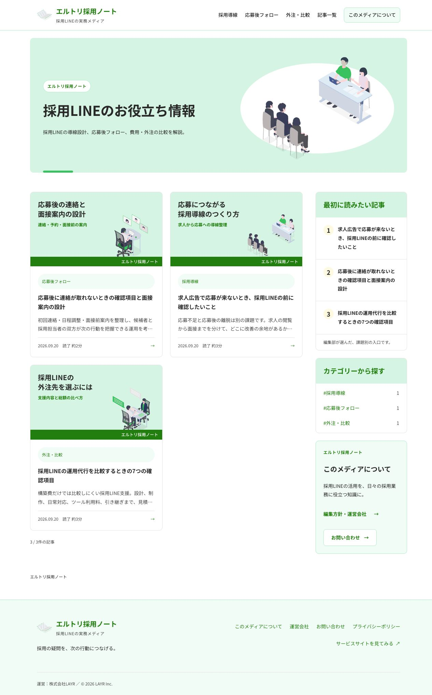
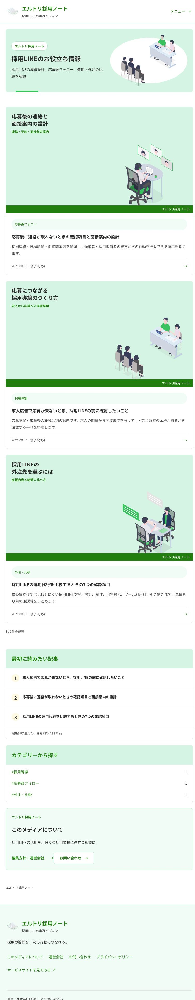
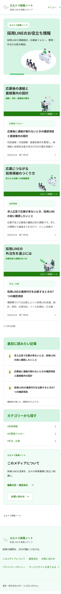

# レビュー: エルトリ採用ノート / モードA / 2026-09-21

最新の指定と最終結果は末尾の「最終追加レビュー」を参照。以下は段階ごとの記録。

対象ブランチ: `codex/ltori-media-hub-20260921`。KUZENブログの配置を参考に、メディア名・カテゴリー別ページ・About・専用フッターを実装。ローカルプレビューで確認。本番公開・外部フォーム送信は行っていない。

## 効いている点

- 記事カード2列と右サイドバーで、最新記事・最初に読む記事・カテゴリーを別の入口として提示している。768px以下は1列で記事を先に読める。
- ヘッダーの3カテゴリーは独立したURLへ遷移し、該当記事のみを掲載。記事数・サイトマップ・構造化データは公開済み記事から生成する。
- メディアとサービスの名称を分離し、Aboutに運営会社・編集方針・サービスとの関係を明記した。会社共通の販促フッターはメディアから外れている。
- 公開3記事の実数を表示し、サイドバーは「最初に読みたい記事」と明記。未取得のPVや人気順位を表示していない。

## 対象ファイル

- `/Users/kawadeikkan/Desktop/Company-Brain/株式会社LAYR/.worktrees/codex-ltori-media-hub-20260921/src/layouts/Base.astro`
- `/Users/kawadeikkan/Desktop/Company-Brain/株式会社LAYR/.worktrees/codex-ltori-media-hub-20260921/src/layouts/LtoriMedia.astro`
- `/Users/kawadeikkan/Desktop/Company-Brain/株式会社LAYR/.worktrees/codex-ltori-media-hub-20260921/src/components/LtoriMediaCard.astro`
- `/Users/kawadeikkan/Desktop/Company-Brain/株式会社LAYR/.worktrees/codex-ltori-media-hub-20260921/src/components/LtoriMediaSidebar.astro`
- `/Users/kawadeikkan/Desktop/Company-Brain/株式会社LAYR/.worktrees/codex-ltori-media-hub-20260921/src/lib/ltori-media.mjs`
- `/Users/kawadeikkan/Desktop/Company-Brain/株式会社LAYR/.worktrees/codex-ltori-media-hub-20260921/src/pages/service/ltori/media/index.astro`
- `/Users/kawadeikkan/Desktop/Company-Brain/株式会社LAYR/.worktrees/codex-ltori-media-hub-20260921/src/pages/service/ltori/media/[slug].astro`
- `/Users/kawadeikkan/Desktop/Company-Brain/株式会社LAYR/.worktrees/codex-ltori-media-hub-20260921/src/pages/service/ltori/media/category/[category].astro`
- `/Users/kawadeikkan/Desktop/Company-Brain/株式会社LAYR/.worktrees/codex-ltori-media-hub-20260921/src/pages/service/ltori/media/about.astro`
- `/Users/kawadeikkan/Desktop/Company-Brain/株式会社LAYR/.worktrees/codex-ltori-media-hub-20260921/src/styles/ltori-media.css`

## Blocker / High / Medium / Nit

- Blocker: 0。確認した画面に横スクロールなし。各ページのh1は1個。
- High: 0。共通トークンの変更、新色、影、800/900ウェイトを追加していない。
- Medium: 0。カードとメディア情報を共通化。KUZENに合わせた中央見出し・記事カード・38pxのカラム間隔は河出さんの指定を優先したもの。
- Nit: 0。

## ゲート結果

| 確認 | 結果 |
|---|---|
| `npm run build` | 66ページを生成、成功 |
| `node --test tests/*.test.mjs` | 63件成功、失敗0 |
| `bash scripts/gate-regression.sh` | 12項目とも既存基準から悪化なし |
| メディアCSSのdesign-gate | 12項目PASS |
| `git diff --check` | エラーなし |
| 一覧の表示幅 | 1440 / 1280 / 768 / 390 / 375で確認、横にはみ出さない |
| 記事詳細 | 1440 / 390で目次・本文を確認。スマホは目次が本文の前へ |
| カテゴリー | PCヘッダー・スマホメニューから遷移。3ページとも掲載制御を生成HTMLで検証 |
| About・フッター | PC・390で確認。運営会社リンクはAboutの該当欄へ遷移 |
| コンソール | 最終確認時の取得可能なerrorログ0件 |
| コントラスト | 実表示の緑文字と白5.36:1、補助文字と白9.17:1 |
| アクセシビリティ | h1各1、スキップリンク、focus-visible、44pxの主要メニュー、reduced-motionあり |
| 公開制御 | 下書き・未来記事を除外。canonical・サイトマップ・JSON-LDを検証 |
| フッター分離 | メディア各ページは専用フッター1つ。トップ・サービス・プライバシーは既存フッターを維持 |
| 記事別計測 | ブラウザで本文リンクに `source=media/interview-followup` が付くことを確認。クリックをleadへ加算しない既存テストも成功 |

メディアCSSの定量値: 影0、中央揃え2、800/900ウェイト0、直値hex0、太い全面border0、easing欠落0、focus-visible定義1、変数循環0、未定義変数0。フォントサイズは変数参照のため機械集計0、実際の型スケールは7種類。

CSS変数は共通スタイルから継承する。単独CSSへのゲートは継承元を判定できないため、共通ファイルのカスタムプロパティ宣言とメディアCSSを結合した一時ファイルで検証した。共通スタイル本体は変更していない。

## 既存資産の現状

サイト全体の既存CSSにはゲート基準を超える影・中央揃え等がある。回帰ゲートは影89/基準90、中央揃え46/基準46、font-size49/基準49、直値hex20/基準20、太い全面border8/基準8で悪化なし。今回の範囲では一斉是正しない。

## 未実施のチェック

- 19記事以上での「もっと見る」のブラウザ操作: 現在の公開記事は3本。3本すべての初期表示とボタン非表示は確認し、18件単位の追加・フォーカス移動は実装を確認した。
- GA4・Search Consoleの実データ取得、相談フォーム実送信: このUI改修の検証では行っていない。計測値・集客成果を断定しない。
- Cloudflare公開プレビュー・本番反映: ローカル確認版。公開時はAGENTS.mdのPR・承認手順を使用する。今回のブラウザ画像は操作結果で確認し、新しいPNGファイルとしては保存していない。

PASS

## 追加レビュー: 色・アイソメトリックの改修

河出さんの追加指定を受け、エルトリの既存イラスト4点をメディアの見出しとサムネイルに使用した。新しいファイルは `src/components/LtoriMediaHeading.astro`。他の変更は上記対象のメディアファイル内。共通CSS・サービスサイト本体・画像ファイルは変更していない。

### 効いている点

- 採用全体・接点づくり・面接・運用設計というイラストの内容をページやカテゴリーに対応させた。カテゴリー名も併記し、色だけに意味を持たせていない。
- 単色の濃緑だったサムネイルを、淡い緑・黄・グレーの面とイラストへ変更。記事の正式タイトルは直下に全文残している。
- 記事本文は緑の見出し帯で区切り、目次からの移動と読み進めやすさを確認した。

### 確認結果

- build: 66ページ成功。全テスト63件成功。回帰ゲートは既存基準から悪化なし。
- メディアCSSの定量ゲート: 12項目PASS。影0、中央揃え1、800/900ウェイト0、新規hex0、未定義変数0。型スケールは7種類のまま。
- 一覧: 1440 / 1280 / 768 / 390 / 375で表示確認。ドキュメントの横はみ出し0。画像4点の読込成功を確認。
- スマホメニューから応募後フォローへ移動し、該当1記事だけ表示することを確認。Aboutは1280、記事本文と目次リンクは375で確認。
- 375で「応募後フォロー」が語の途中で分割される問題を修正。「応募後」「フォロー」の単位で折り返す。
- 実表示の小さい緑文字と背景のコントラスト: 淡黄5.04:1、薄緑4.52:1、グレー4.60:1。すべて4.5:1以上。
- 画像に実寸と表示枠を指定。カード画像はlazy、トップ画像はhigh priority。既存WebPを参照し、新たな画像生成・配布ファイルは増やしていない。
- h1は各ページ1個。装飾画像は空alt、focus-visible・reduced-motionを保持。コンソールerrorログ0件。
- 本文の問い合わせリンクに記事IDを引き継ぐことを確認。外部への実送信と本番公開は行っていない。

Blocker 0 / High 0。公開環境での通信速度・Core Web Vitalsの測定は未実施。ここでの画像表示確認を性能測定として扱わない。

PASS

## 最終追加レビュー: 公式素材・記事末尾・お問い合わせ・ロゴ

2026-09-21。上記の旧イラスト方針・販促枠なし方針は、河出さんの後続指定により、この追加レビューの内容へ更新した。モードA / editorial、正式名はエルトリ採用ノート。

### 効いている点

- 公式ISOME LAB素材を同サイトの色変更機能で #00BF63 に調整。トップ・カテゴリー・記事のイラストを統一し、公開画面に出典表示を置いていない。内部台帳で取得元と規約を管理。
- 記事末尾を、編集部紹介 → テーマ別のサービス案内 → コンパクトなおすすめ → 画像付き関連記事の順へ変更。公開3記事のうち自記事を除いた2記事を表示し、架空の記事や監修実績は追加していない。
- ロゴは正式名の文字と公式の本素材で構成。ヘッダー・フッターに実装し、独立SVGもブラウザで描画確認した。
- About・サイドバー・フッターから専用お問い合わせへ遷移。入力不備、送信中、成功、失敗、タイムアウトを扱い、営業リードと編集部への連絡を分けている。

### 追加対象

- `/Users/kawadeikkan/Desktop/Company-Brain/株式会社LAYR/.worktrees/codex-ltori-media-hub-20260921/src/components/LtoriMediaArticleEnd.astro`
- `/Users/kawadeikkan/Desktop/Company-Brain/株式会社LAYR/.worktrees/codex-ltori-media-hub-20260921/src/components/LtoriMediaBrand.astro`
- `/Users/kawadeikkan/Desktop/Company-Brain/株式会社LAYR/.worktrees/codex-ltori-media-hub-20260921/src/components/LtoriMediaCover.astro`
- `/Users/kawadeikkan/Desktop/Company-Brain/株式会社LAYR/.worktrees/codex-ltori-media-hub-20260921/src/pages/service/ltori/media/contact.astro`
- `/Users/kawadeikkan/Desktop/Company-Brain/株式会社LAYR/.worktrees/codex-ltori-media-hub-20260921/src/lib/media-contact.mjs`
- `/Users/kawadeikkan/Desktop/Company-Brain/株式会社LAYR/.worktrees/codex-ltori-media-hub-20260921/tests/media-contact.test.mjs`
- `/Users/kawadeikkan/Desktop/Company-Brain/株式会社LAYR/.worktrees/codex-ltori-media-hub-20260921/public/service/ltori/media/ltori-note-logo.svg`
- `/Users/kawadeikkan/Desktop/Company-Brain/株式会社LAYR/.worktrees/codex-ltori-media-hub-20260921/public/service/ltori/media/artwork/`
- 既存対象のレイアウト・About・記事詳細・カード・サイドバー・定義・CSSも更新。

### ゲート結果

| 確認 | 結果 |
|---|---|
| ビルド | 67ページ生成、成功 |
| 全テスト | 67件成功、失敗0。フォームは模擬通信のみ |
| 回帰ゲート | 12項目すべて既存基準から悪化なし |
| メディアCSSゲート | 12項目PASS。共通カスタムプロパティ宣言を加えて継承を評価 |
| 定量値 | 影0、中央揃え1、800/900ウェイト0、直値hex0、太い全面border0、focus-visible1、未定義変数0。型スケール7種類 |
| 1440px | 記事末尾・関連記事・問い合わせ画面を目視。記事の幅1425px、横はみ出しなし、h1は1個、画像読み込み成功 |
| 768px | 記事末尾のおすすめ・関連記事を目視。横はみ出しなし、h1は1個 |
| 375px | 一覧・記事末尾・お問い合わせを目視。ボタンは縦積み、カードは1列。幅360pxで横はみ出しなし |
| 導線 | スマホメニューから応募後フォローへ移動し1記事のみ掲載。Aboutの編集部ボタンから専用フォームへ移動 |
| フォーム | 必須5項目と同意を確認。会社メールを受信先に設定。送信失敗時に入力保持、重複防止、遅延成功の誤表示防止をテスト |
| 記事別CTA | article_service / article_consultation / article_bodyを区別。相談URLにmedia/interview-followupを引き継ぐことをブラウザで確認 |
| SVG | 5素材をXML解析。script・foreignObject・イベント属性・外部hrefなし |
| ロゴ | 独立SVGをブラウザで描画し、表記・欠落・切れがないことを確認 |

Blocker 0 / High 0。既存共通CSSの負債は変更していない。ライブラリの既存remarkPlugins非推奨警告はビルド成功に影響しない。

### 年間記事企画

- ネイティブGoogleスプレッドシートを会社アカウント info@layr.co.jp に作成。
- URL: https://docs.google.com/spreadsheets/d/1LQdDfofB6CCsgezFxs_A5A17bnBgNLzSTufVVYvpcgM/edit
- 2026年10月〜2027年9月、月10本。合計120本＝導入・比較48＋実務・課題48＋業種別24。月別集計数式の再計算とライブ値を確認。
- 120個の主キーワード・タイトル、関連IDの参照、月ごとの10本を作成スクリプトで確認。
- 月別計画／記事企画／運用メモの3タブ。記事企画はネイティブテーブル、日付列、選択式の分類・優先度・状態、5行・2列の固定を設定。
- ブラウザは別アカウント（業務委託用）でログインしており、会社アカウントは未ログイン。共有設定を広げず、公式APIから再エクスポートした3タブをレンダリングして確認。
- 再エクスポートのテーブル色・折り返しはレンダラーとの差異があったため、ネイティブCellDataのeffectiveFormatも確認。実シートは白／淡灰の交互行、Noto Sans JP 12pt、WRAP、緑の見出し。シートのライブブラウザ描画は未確認。
- 検索量は未計測、優先度は編集判断。企画の根拠・公開前の確認条件と、取材が必要な2企画の条件を明記。

### 未実施

- 本番反映・Cloudflareプレビュー公開。
- 問い合わせの実送信、FormSubmit受信先の有効化状況、メールボックス到着・返信先確認。受付成功の模擬検証を実メール受信の証拠にしない。
- GA4・Search Consoleの実データ受信と集客成果の確認。
- 公開環境のCore Web Vitals測定。

PASS

## 公開直前確認（2026-09-21）

河出さんの「その前に一旦、サイトを本番反映してください」に基づき、今回のメディア改修を公開対象とした。キーワード実測・管理ツールの新規開発は含めない。

- 最新 origin/main と同じ基点で競合なし。別担当の読み取り専用レビューも Blocker 0。
- `npm run check`: 67ページ生成、回帰ゲート12項目成功。
- `node --test tests/*.test.mjs`: 67件成功、失敗0。お問い合わせの模擬テストをCIにも追加。
- `npm run check:cloudflare`: Wrangler dry-run成功。
- ブラウザで1280 / 768 / 390pxを確認。モバイル横はみ出しなし。画像は下記に保存。

Cloudflare公開プレビュー、リモートCI、本番確認はPR上に結果を記録する。実メール受信・GA4/GSC実データ確認は引き続き未実施。
