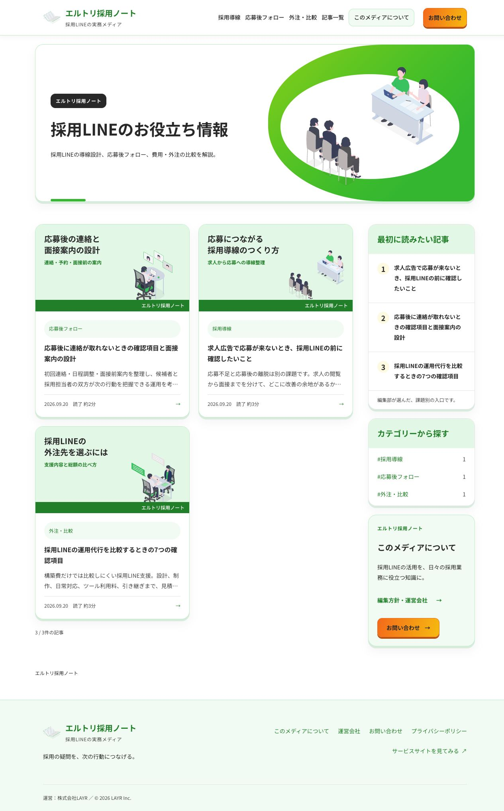
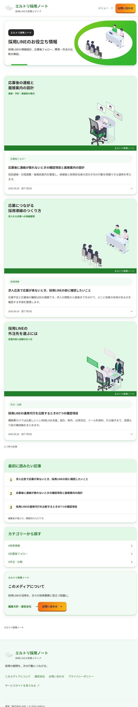
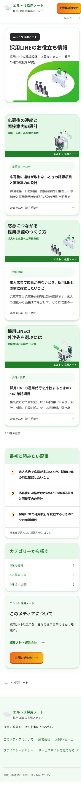
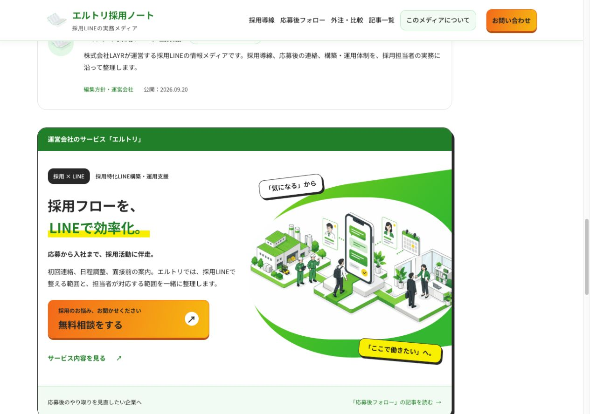
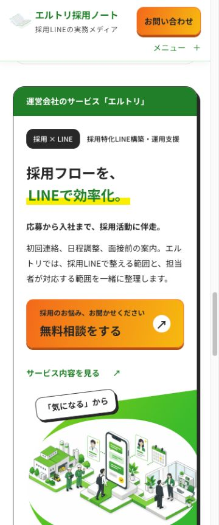

# メディアのサービスサイト準拠デザイン / 2026-09-22

モードA / editorial。本人指定「右上にお問い合わせ」「全体のトンマナをサービスサイトに」「CTAオレンジ・影」「運営会社サービス枠を添付Heroと同デザイン、採用フローをLINEで効率化」を反映。

- メディアヘッダー右上に常時表示の専用お問い合わせ。PC/768pxは1段、390/375pxはロゴとCTAの下にメニューを配置。
- サービス由来の緑・橙・黄色、曲面背景、カード陰影をメディア専用CSSで定義。会社共通CSSとサービス本体は変更なし。
- 記事内エルトリ案内を「採用フローを、LINEで効率化。」のバナーに変更。添付指定を受け、この枠だけ自社サービスの既存Hero画像を再利用。他の画像は公式ISOME LAB素材を継続。
- 本文、SEO情報、記事別の相談source、article_consultation / article_service計測を維持。

## 検証

- npm run check: 67ページ、回帰ゲート12項目成功。
- node --test tests/*.test.mjs: 67件成功。
- 独立レビュー: Blocker / High 0。メディア・attribution関連18テストも確認。
- デザインゲート: 12項目PASS（共通カスタムプロパティの継承宣言を検査用に追加）。影6、中央揃え1、root外hex0、800/900なし、未定義変数/循環0。
- 1280/768/390/375pxで横はみ出しなし。右上CTA110×48px以上。375/390pxヘッダー高105px、記事アンカー余白132px。
- PCナビ境界1025pxで右上CTAが画面内に収まることを確認。
- 375pxの右上CTAから専用お問い合わせへ実遷移、フォーム表示とaria-current=pageを確認。実送信なし。
- CTAの文字/橙色のコントラストは最小5.12:1（アンバー側8.53:1）。20px本文級の文字も読み取り可能。
- 記事内バナーの相談URLは /contact/?service=ltori&source=media%2Finterview-followup。3記事とも固有sourceを静的HTMLでも確認。
- 添付一時パス2811384は存在せず参照不可。後続で添付されたサービスサイト画像2枚と公開サービスサイトを参照。

Cloudflareプレビュー・本番の確認結果は公開PRに追記する。検索ボリューム測定と管理ツールは別の変更として進行中。

PASS
